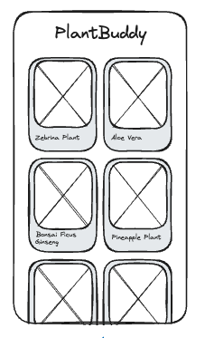

# US1 - Plant List

## Value Proposition

As a plants enthusiast  
i want to see a list of plants  
so that i can have an overview of different plants to get some inspiration

## Description

a list of all the plants  

## Acceptance Criteria

- [ ] there is an app title above the list of current plants
- [ ] there is a list of random plants displayed on the homepage
- [ ] each plant of the list includes following details:
  - [ ] name of the plant
  - [ ] image of the plant
- [ ] the list of plants is vertically scrollable
- [ ] app title is always visible
- [ ] an error message is displayed to the user if there is an issue loading the plants data

## Tasks

- [ ] create the feature branch "plant-list"
- [ ] create your own database with example plants
- [ ] create card component for the HTML structure(grid view)which renders in Homepage:
- [ ] name of the plant
- [ ] image of the plant
