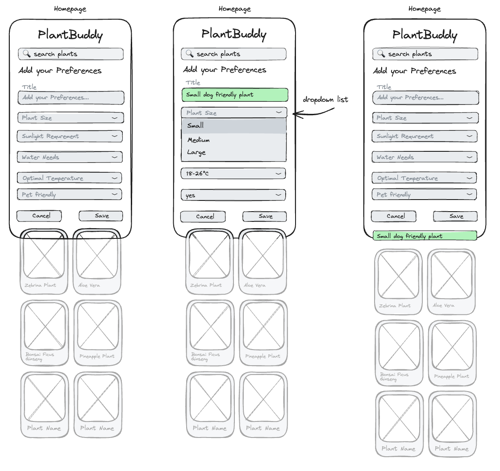

# US4 - Add Plant Preferences

## Value Proposition

As a plants enthusiast  
i want to be able to add my plant preferences  
so that i can only see plants that fit my needs.

## Description

a navigation bar at the bottom  

## Acceptance Criteria

- [ ] a form with the title "Add your Preferences" is on the homepage above the plant cards displayed
- [ ] the form includes six fields
  - [ ] "title" field to define a preference title
  - [ ] "plant size" with the select options small, medium, large
  - [ ] "Sunlight Requirement" with the select options bright, low, indirect, medium
  - [ ] "Water needs" with the select options low, medium, high
  - [ ] "Optimal Temperature" with the select options "15-27°C", "20-30°C", "18-24°C"...
  - [ ] "Pet friendly" with the select options true or false
- [ ] underneath the form are two buttons
  - [ ] Save to save the preferences
  - [ ] Cancel to reset the form
- [ ] after successful saving, the title is added to the list of preferences

## Tasks

- [ ] create the feature branch "AddPreferences"
- [ ] create a form component
- [ ] create a form displayed as a list
- [ ] create a text input field with a placeholder "Type in a title" and a label named "title", the field is required
- [ ] create a dropdown selection field with the title "Plant Size", the field is not required
- [ ] create a dropdown selection field with the title "Sunlight Requirement", the field is not required
- [ ] create a dropdown selection field with the title "Water needs", the field is not required
- [ ] create a dropdown selection field with the title "Optimal Temperature", the field is not required
- [ ] create a dropdown selection field with the title "Pet friendly", the field is not required
- [ ] create a save button and store the typed data with the useState-method
- [ ] create a cancel button to reset the form and focus on the title text input field
