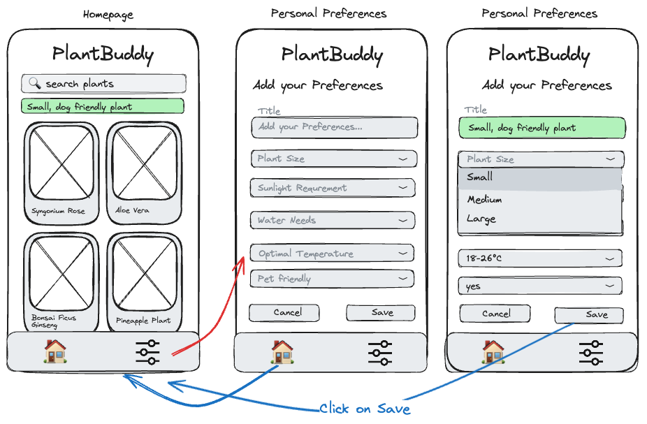

# US5 - Add Plant Preferences Page + Navigation Bar

## Value Proposition

As a plants enthusiast  
i want to be able to navigate through the app and have a clear structure of the features  
so that i can see directly what my preferences are and the plants that go with it on the homepage.

## Description

a navigation bar at the bottom  

## Acceptance Criteria

- [ ] a navbar is displayed at the bottom (fixed)
- [ ] the preferences form is now located at a own Preferences Page
- [ ] Two icons are implemented and when clicked get the user to homepage or to the personal preferences Page
- [ ] the added title of the preferences is above the plants overview

## Tasks

- [ ] create the feature branch "feature-preferences-page"
- [ ] create a page named "plantPreferences"
- [ ] create navbar component to get to the Plant Preferences or to get back to the homepage "/"
- [ ] implement a svg of a house to the navbar and link it to the homepage "/"
- [ ] implement a svg of a adjustments-icon to the navbar and link it to the preferences page "/plantPreferences"
